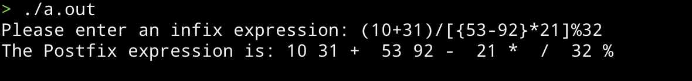
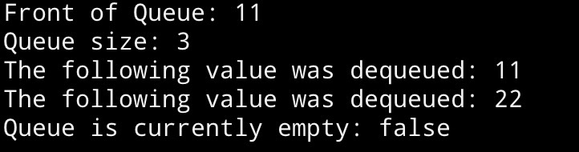

# CS303_ASM

## Question 1 | Infix to Prefix Converter

Upon running the program, user will be prompted to enter an infix expression.

After entering an infix, the program will check if the parentheses, brackets and curly brackets in the expression are balanced before converting the user-entered infix function into a postfix function.

#### Screenshot of program output:



## Question 2 | Queue Implementation

Upon running the program, the user will see outputs from a driver program to indicate that the queue is functioning.

### The Queue implementation contains the following methods:

1. enqueue(value) function inserts elements at the rear of the queue.
2. dequeue() function removes and returns the front element.
3. front() function returns the front element without removing it.
4. isEmpty() function checks if the queue is empty.
5. getSize() function returns the total number of elements in the queue.

#### The following code will be executed to verify functional implementation of Queue:

```cpp
Queue<int> intQueue;

    intQueue.enqueue(11);
    intQueue.enqueue(22);
    intQueue.enqueue(33);

    cout << "Front of Queue: " << intQueue.getFront() << endl;
    cout << "Queue size: " << intQueue.getSize() << endl;

    cout << "The following value was dequeued: " << intQueue.dequeue() << endl;
    cout << "The following value was dequeued: " << intQueue.dequeue() << endl;

    cout << "Queue is currently empty: " << (intQueue.isEmpty() ? "true" : "false") << endl;
```

#### Screenshot of program output:

)
